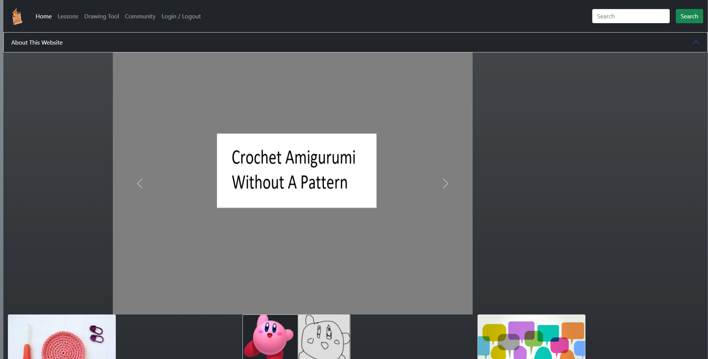
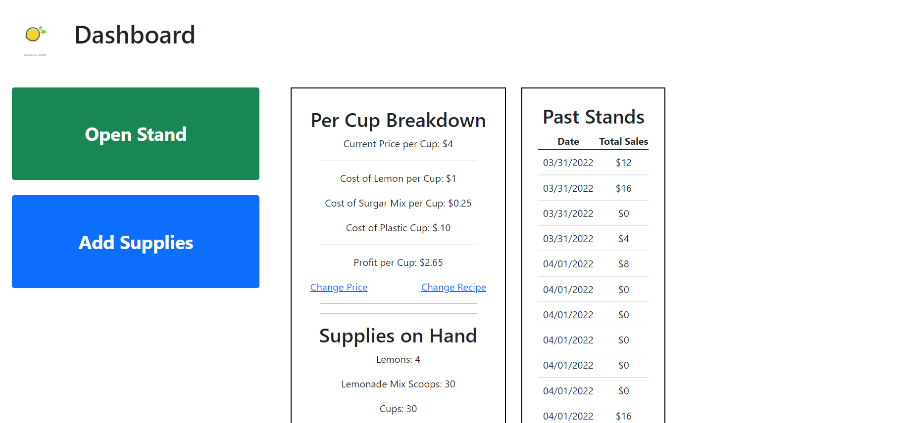
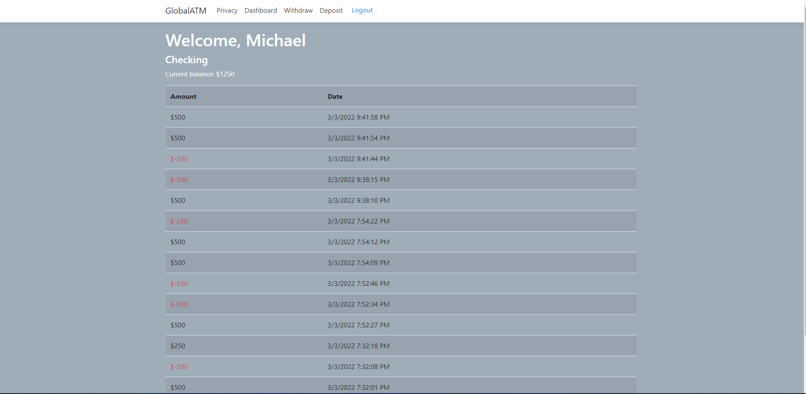

# Michael Fuller
#### Full-Stack Developer

#### Hello!
I am an aspiring full-stack developer with a passion for emerging technologies, and how to apply those technologies for the greater good.
It has been a fairly circuitous path for me, beginning with four years in the US Marine Corps in the telecommunications field. Then, I had a short career in education, where I tried my hand at teaching English at a local high school. For a change in pace, I began working in the plumbing and welding industry. While welding has always been a hobby of mine, I found myself ready for yet another change. In the past, I often considered software development to be beyond my capabilities. Recently, however, I decided to put that fear to the test, enrolled in some courses, and now I finally feel that I am on track towards a career both intrinsically rewarding and intellectually challenging. 

I look forward to getting to know you!

Here, you can find my most recent [resume](./assets/updatedResume.docx).

## Projects
Below, I have posted some links to full-stack web apps that I have developed. These are constantly in flux, growing as my own abilities do, so please forgive me if the link is temporarily broken! Try again soon, I assure you that it will be back up, with further development. 

Python Project can be found [here](http://ec2-18-233-169-51.compute-1.amazonaws.com/).

MERN project can be found [here](http://ec2-54-234-163-175.compute-1.amazonaws.com/).

C# project can be found [here](http://ec2-3-89-75-4.compute-1.amazonaws.com/).

## Contact Me

I hope to hear from you, whatever the occasion.

michaelfuller3@u.boisestate.edu
[LinkedIn](https://www.linkedin.com/in/michael-fuller-486b211b8/)
